# 401 Code Challenges Table of Contents

1. [Code Challenge 1: Reverse Array](#Reverse-an-Array)
2. [Code Challenge 2: Array Shift](#Array-Shift)
3. [Code Challenge 3: Binary Search](#Binary-Search)
4. [Code Challenge 5: Linked List Implementation](#Singly-Linked-List)
5. [Code Challenge 6: Insertions](#Insertions)
6. [Code Challenge 7: Kth Value From End](#K-th-Value-From-End)
7. [Code Challenge 8: Linked List Zipped](#Linked-List-Zipped)
8. [Code Challenge 10: Stack and a Queue Implementation](#Stacks-and-Queues)
9. [Code Challenge 11: Queue with Stacks](#Queue-with-Stacks)
10. [Code Challenge 12: First In, First Out Animal Shelter](#First-In,-First-Out-Animal-Shelter)
11. [Code Challenge 13: Multi Bracket Validation](#Multi-Bracket-Validation)
12. [Code Challenge 15: Trees: BT and BTS](#Trees-BT-and-BTS)
13. [Code Challenge 16: Maximum Value in a Binary Tree](#Maximum-Value-in-a-Binary-Tree)
14. [Code Challenge 17: Breadth First Traversal](#Breadth-First-Traversal)
15. [Code Challenge 27: Merge Sort](challenges/src/main/java/challenges/sorts/merge/blog.md)
16. [Code Challenge 28: Quick Sort](challenges/src/main/java/challenges/sorts/quick/blog.md)
17. [Code Challenge 30: Hash Table Implementation](#Hash-Table-Implementation)
18. [Code Challenge 31: Repeated Word](#Repeated-Word)
19. [Code Challenge 32: Tree Intersection](#Common-Value-Trees)
20. [Code Challenge 33: HashMap Left Join](#Hashmap-LEFT-JOIN)
21. [Code Challenge 35: Graph Implementation](#Graph-Implementation)
22. [Code Challenge 36: Breadth First Graph Traversal](#Breadth-First-Graph-Traversal)
23. [Code Challenge 37: Get Edges](#Get-Edges)
24. [Code Challenge 38: Depth First Traversal](#Depth-Graph-Traversal)

## Reverse an Array

- Write a function called ```reverseArray``` which takes an array as an argument. Without utilizing any of the built-in methods available to your language, return an array with elements in reversed order.

### Challenge Description

- Be able to take an array as our input and reverse order the contents of the array as the output
- Ex. Input: [1, 2, 3, 4, 5, 6] -> Output: [6, 5, 4, 3, 2, 1]

### Approach & Efficiency

- Google searched methods of reversing arrays in Java and then reserve engineered the method to better understand.

### Solution

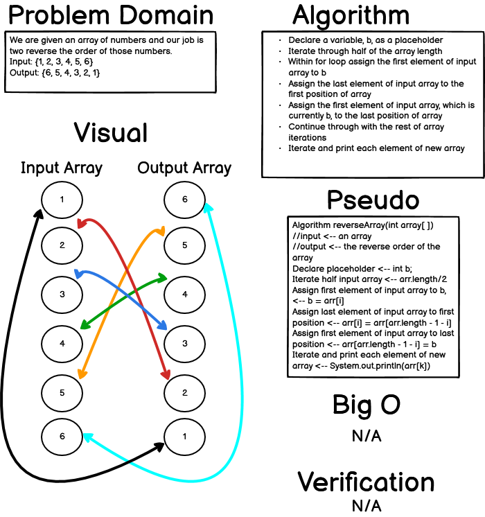

__________________________________________________________________________________

## Array Shift

- Write a function called ```insertShiftArray``` which takes in an array and the value to be added. Without utilizing any of the built-in methods available to your language, return an array with the new value added at the middle index.

### Challenge Description 2

- Be able to take an array and value as our parameters and place the value in the middle of the input array to create a whole new array
- Ex. Input: [2, 4, 6, 8,], 5 -> Output: [2, 4, 5, 6, 8]

### Approach & Efficiency 2

- The first approach was to write everything down on the whiteboard to gain a better understanding of our problem domain, get a better understanding by creating a visual and using that visual to create our alogrithm for the problem.

- Space: O(n)
- Time: O(n)

### Solution 2

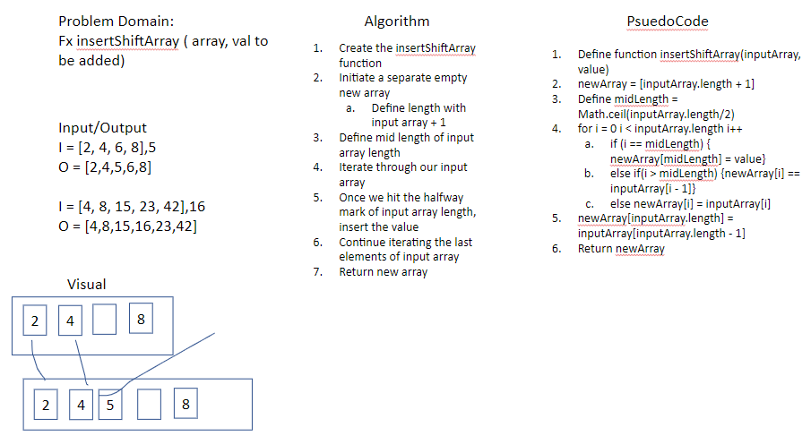

__________________________________________________________________________________

## Binary Search

- Write a function called ```BinarySearch``` which takes in 2 parameters: a sorted array and the search key. Without utilizing any of the built-in methods available to your language, return the index of the array’s element that is equal to the search key, or -1 if the element does not exist.

### Challenge Description 3

- Be able to take an sorted array and value as our paramters and iterate through array to find element that matches key value and return the key's index. If key value doesn't exist in array, then return -1.
- Ex. Input: [4, 8, 15, 16, 23, 42], 15 -> Ouput: 2

### Approach & Efficiency 3

- Take an sorted array, define first, last and middle index. Iterate through a while loop to find middle value of array. Short array search by half each time and define new first and last of array. If sorted array at the mid index equals the key value, then return mid index. If key value does not exist, return -1.

- Space: O(1)
- Time: O(1)

### Solution 3

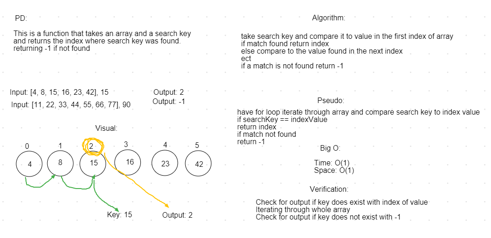

## Singly Linked List

- Create a adds, checks and outputs the elements within the Linked List.

### Challenge

1. Can successfully instantiate an empty linked list
2. Can properly insert into the linked list
3. The head property will properly point to the first node in the linked list
4. Can properly insert multiple nodes into the linked list
5. Will return true when finding a value within the linked list that exists
6. Will return false when searching for a value in the linked list that does not exist
7. Can properly return a collection of all the values that exist in the linked list

### Approach & Efficiency 4

- Big O for insert method:
  - Time: O(1)
  - Space: O(1)
- Big O for includes method:
  - Time: O(1)
  - Space: O
- Big O for toString method:
  - Time: O(1)
  - Space: O(1)

### API

- insert(): Takes any value as an argument and adds a new node with that value to the head of the list with an O(1) Time performance.

- includes(): Takes any value as an argument and returns a boolean result depending on whether that value exists as a Node’s value somewhere within the list.

- toString(): Takes in no arguments and returns a string representing all the values in the Linked List.

## Insertions

- Building off the last Code Challenge by creating various methods to insert values into the Linked List.

### Challenge Description 5

- ```.append(value)``` which adds a new node with the given value to the end of the list
  - Ex. Input: head -> [1] -> [3] -> [2] -> X, 5
  - Output: head -> [1] -> [3] -> [2] -> [5] -> X

- ```.insertBefore(value, newVal)``` which add a new node with the given newValue immediately before the first value node
  - Ex. Input: head -> [1] -> [3] -> [2] -> X, 3, 5
  - Output: head -> [1] -> [5] -> [3] -> [2] -> X

- ```.insertAfter(value, newVal)``` which add a new node with the given newValue immediately after the first value node
  - Ex. Input: head -> [1] -> [3] -> [2] -> X, 3, 5
  - Output: head -> [1] -> [3] -> [5] -> [2] -> X

### Approach & Efficiency 5

- Big O for ```.appened```
  - Space: O(n)
  - Time: O(n)

- Big O for ```.insertBefore```
  - Space: O(n)
  - Time: O(n)

- Big O for ```.insertAfter```
  - Space: O(n)
  - Time: O(n)

### Solution 5

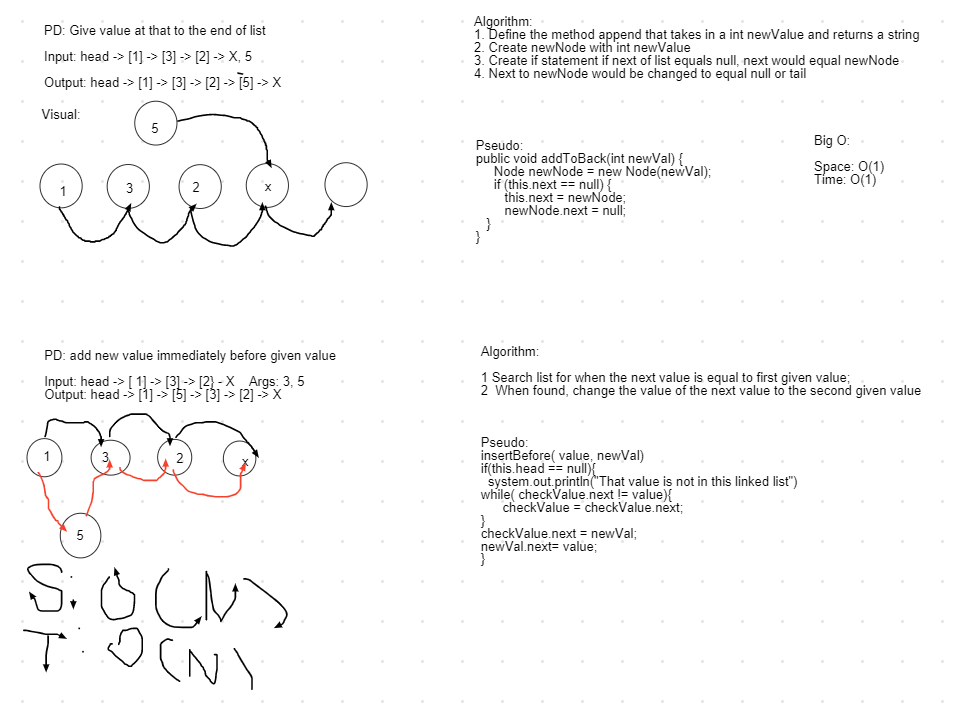

## K-th Value From End

- Again building off the last Code Challenge, but now be able to identidy the value of Node given the arguement of Linked List position.

### Challenge Description 6

- Write a method for the Linked List class which takes a number, k, as a parameter. Return the node’s value that is k from the end of the linked list. You have access to the Node class and all the properties on the Linked List class as well as the methods created in previous challenges.
  - Ex. Input: head -> [1] -> [3] -> [8] -> [2] -> X, 0
  - Output: 2

### Approach & Efficiency 6

- Big O
  - Time: O(n)
  - Space: O(n)

### Solution 6

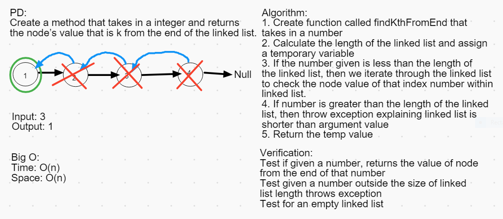

## Linked List Zipped

- Write a function called zipLists which takes two linked lists as arguments.
- Zip the two linked lists together into one so that the nodes alternate between the two lists and return a reference to the head of the zipped list.
- Ex. zipLists(list1, list2)
  - Arg list1: head -> [1] -> [3] -> [2] -> X
  - Arg list2: head -> [5] -> [9] -> [4] -> X
  - Output: head -> [1] -> [5] -> [3] -> [9] -> [2] -> [4] -> X

### Challenge 7

- Alternate between linked lists to create new Linked list of all values in both.

### Approach & Efficiency 7

- O(n);
  - Take head of first linked list, put into separate linked list. Linked list call .next method on head of first list.
  - Go to head of second list, put into next position. Use insert method on new linked list.
  - Alternate between both.

### Solution 7

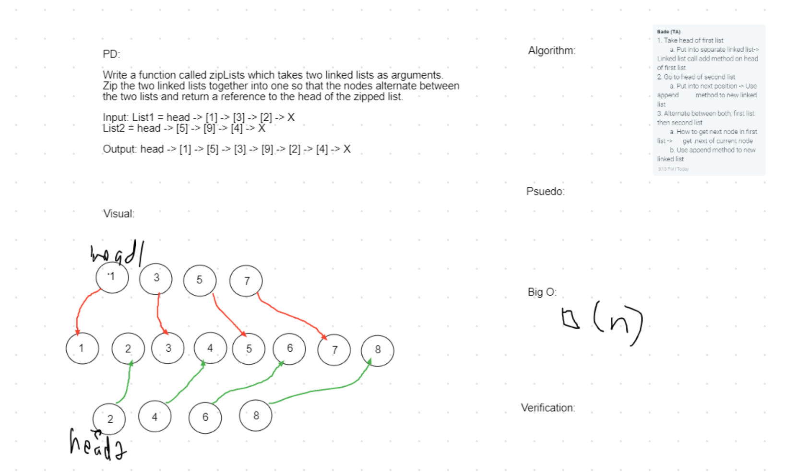

## Stacks and Queues

- Stack

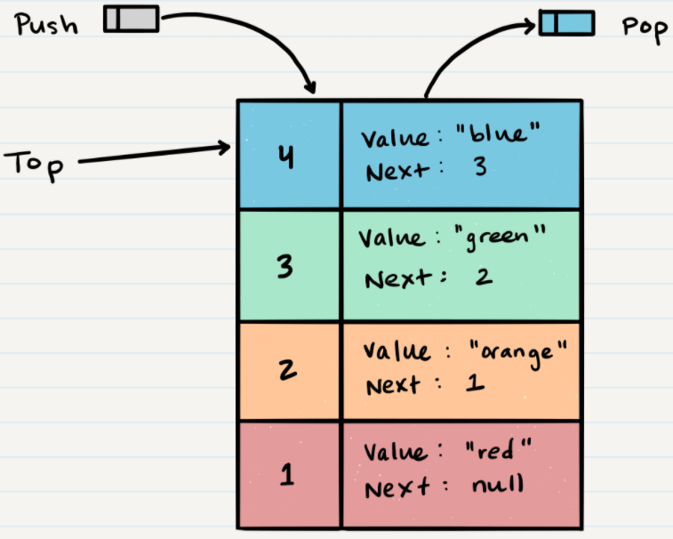

- Queue

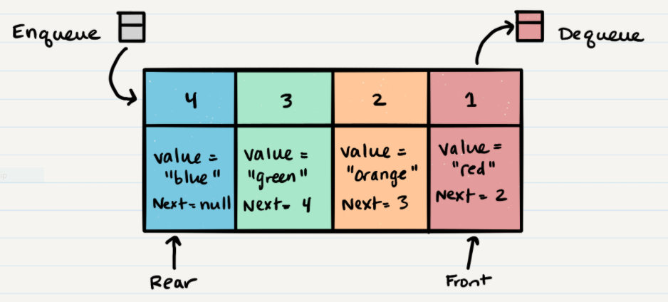

### Challenge 8

- Create methods that manipulate the elements of a stack or queue

### Approach & Efficiency 8

- Big O for push, pop, enqueue and dequeue methods
  - Time: O(1)
  - Space: O(n)

### API 8

- Stack
  - push
    - Define a method called push which takes any value as an argument and adds a new node with that value to the top of the stack with an O(1) Time performance.
  - pop
    - Define a method called pop that does not take any argument, removes the node from the top of the stack, and returns the node’s value.
  - peek
    - Define a method called peek that does not take an argument and returns the value of the node located on top of the stack, without removing it from the stack.
  - isEmpty
    - Define a method called isEmpty that takes no argument, and returns a boolean indicating whether or not the stack is empty.
- Queue
  - enqueue
    - Define a method called enqueue which takes any value as an argument and adds a new node with that value to the back of the queue with an O(1) Time performance.
  - dequeue
    - Define a method called dequeue that does not take any argument, removes the node from the front of the queue, and returns the node’s value.
  - peek
    - Define a method called peek that does not take an argument and returns the value of the node located in the front of the queue, without removing it from the queue.
  - isEmpty
    - Define a method called isEmpty that takes no argument, and returns a boolean indicating whether or not the queue is empty.

## Queue with Stacks

- Instead, this PseudoQueue class will implement our standard queue interface (the two methods listed below), but will internally only utilize 2 Stack objects.

### Challenge Description 11

- enqueue(value) which inserts value into the PseudoQueue, using a first-in, first-out approach.

- dequeue() which extracts a value from the PseudoQueue, using a first-in, first-out approach.

### Approach & Efficiency 11

- Big O for enqueue and dequeue
  - Time: O(n)
  - Space: O(n)

### Solution 11

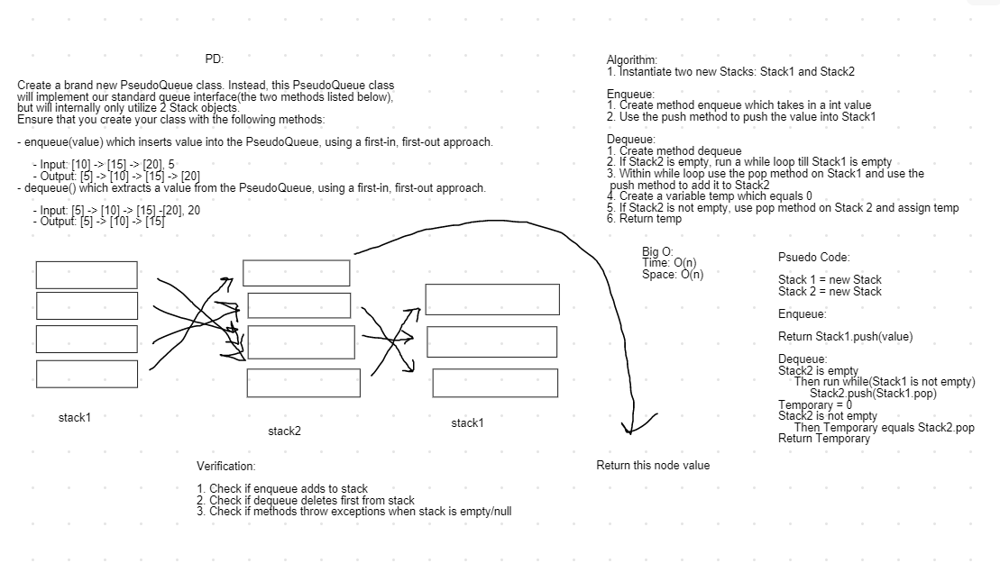

## First In, First Out Animal Shelter

- Create a class called AnimalShelter which holds only dogs and cats. The shelter operates using a first-in, first-out approach.

### Challenge Description 12

- Implement the following methods:
  - enqueue(animal): adds animal to the shelter. animal can be either a dog or a cat object.
    - Input: {Fritzy:Cat} -> {Oro:Dog} -> {Theo: Cat}, {Blue:Cat}
    - Output: {Blue:Cat} -> {Fritzy:Cat} -> {Oro:Dog} -> {Theo: Cat}
  - dequeue(pref): returns either a dog or a cat. If pref is not "dog" or "cat" then return null.
    - Input: {Blue:Cat} -> {Fritzy:Cat} -> {Oro:Dog} -> {Theo: Cat}, Dog
    - Output: {Blue:Cat} -> {Fritzy:Cat} -> {Theo: Cat}

### Approach & Efficiency 12

- Big O for Enqueue
  - Time: O(1)
  - Space: O(1)
- Big O for Dequeue
  - Time: O(n)
  - Space: O(1)

### Solution 12

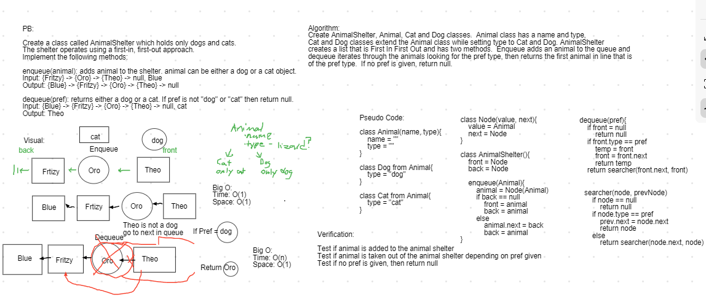

## Multi Bracket Validation

- Check a string and see if it contains either '()', '{}', or '[]' and return either true or false. True if each opening braket has a repective closing bracket or false if the opening bracket doesn't have a closing bracket.

### Challenge Description 13

- Create a method ```public static boolean multiBracketValidation(String input)```
  - Your function should take a string as its only argument, and should return a boolean representing whether or not the brackets in the string are balanced. There are 3 types of brackets:
    - Round Brackets : ()
    - Square Brackets : []
    - Curly Brackets : {}
  - Input: {}(){} Output: TRUE
  - Input: [({}] Output: FALSE

### Approach & Efficiency 13

- Big O
  - Time: O(n)
  - Space: O(n)

### Solution 13

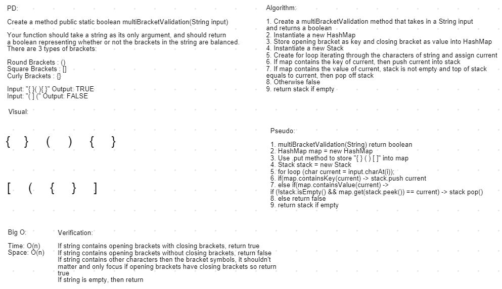

## Trees BT and BTS

- Able to traverse through a binary tree using three different ways:
  - Preorder
  - Inorder
  - Postorder

### Challenge Description 15

- Made a Node, Binary Tree and Binary Search Tree class. The properties in Node consisted of int value, node left and right which shows the direction of numbers depending on the root node. The different methods to traverse a binary tree output an array list of numbers. The order of the numbers depend on the method used.

### Approach & Efficiency 15

- Big O for all three different ways to traverse a binary tree
  - Time: O(n)
  - Space: O(n)

### API 15

- Define a method for each of the depth first traversals called ```preOrder```, ```inOrder```, and ```postOrder``` which returns an array of the values, ordered appropriately.
- Define a method named ```add``` that accepts a value, and adds a new node with that value in the correct location in the binary search tree.
- Define a method named ```contains``` that accepts a value, and returns a boolean indicating whether or not the value is in the tree at least once.

## Maximum Value in a Binary Tree

- Use the findMaximumValue method to find the largest node value within a binary tree

### Challenge Description 16

- Write an instance method called ```find-maximum-value.``` Without utilizing any of the built-in methods available to your language, return the maximum value stored in the tree. You can assume that the values stored in the Binary Tree will be numeric.

### Approach & Efficiency 16

- Big O:
  - Time: O(n)
  - Space: O(h)

### Solution 16

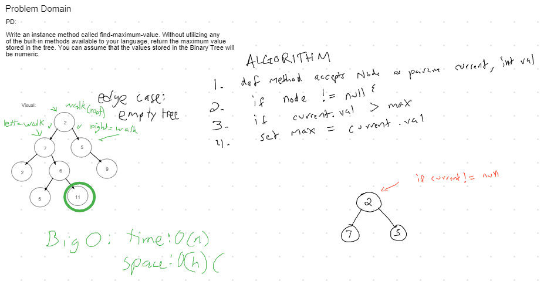

## Breadth First Traversal

- The method will take in a Binary Tree and return an array list of the indvidual nodes of the tree from top to bottom, left to right. The beginning node value of the array would be the root and the last node value of the array is the furthest right leaf node.

### Challenge Description 17

- Write a breadth first traversal method which takes a Binary Tree as its unique input. Without utilizing any of the built-in methods available to your language, traverse the input tree using a Breadth-first approach, and return a list of the values in the tree in the order they were encountered.

### Approach & Efficiency 17

- Big O:
  - Time: O(n)
  - Space: O(n)

### Solution 17

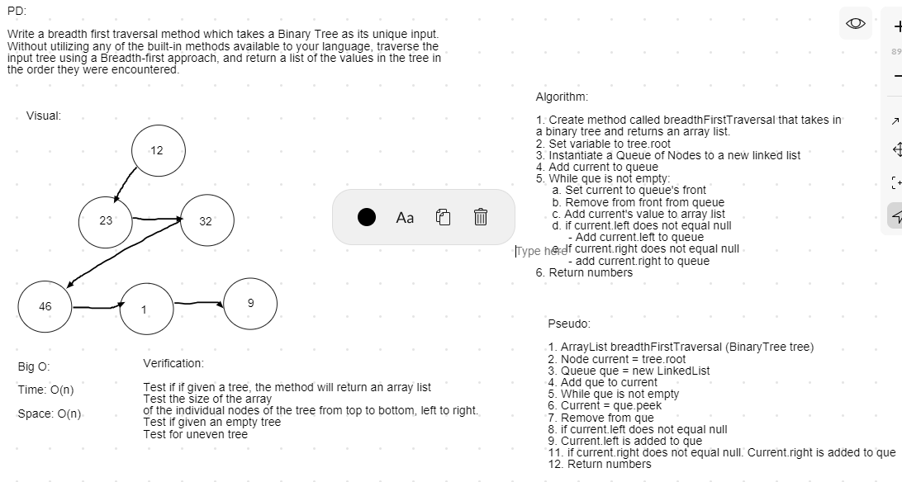

## Hash Table Implementation

### Hashtables

Within the hashtable, the user specifies a key and the value you eant to link with that key. The key is then **hashed**, the hash code is used as the index and the value is stored within the table.

### Challenge 30

- Implement the Hashtable with the following methods:
  - Add
  - Get
  - Contains
  - Hash
- Create tests to make sure the methods are returning the correct results

### Approach & Efficiency 30

- Big O
  - Time: O(1)
  - Space: O(1)

### API 30

- ``add``
  - Takes in both the key and value. This method should hash the key, and add the key and value pair to the table, handling collisions as needed.
- ``get``
  - Takes in the key and returns the value from the table.
- ``contains``
  - Takes in the key and returns a boolean, indicating if the key exists in the table already.
- ``hash``
  - Takes in an arbitrary key and returns an index in the collection.

### Solution 30

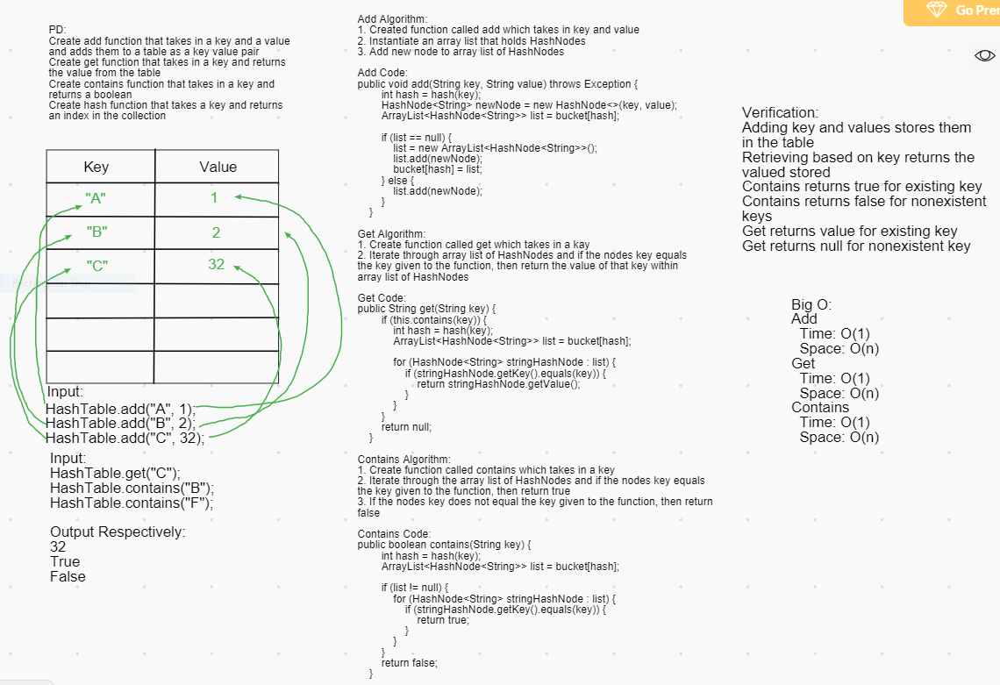

## Repeated Word

- Find the first repeated word in a book.

### Challenge Description 31

- The function method repeatedWord takes in a lengthy string parameter and returns the first word to occcure more than once in the provided string.

### Approach & Efficiency31

- Big O:
  - Time: O(n^2)
  - Space: O(n)

### Solution 31

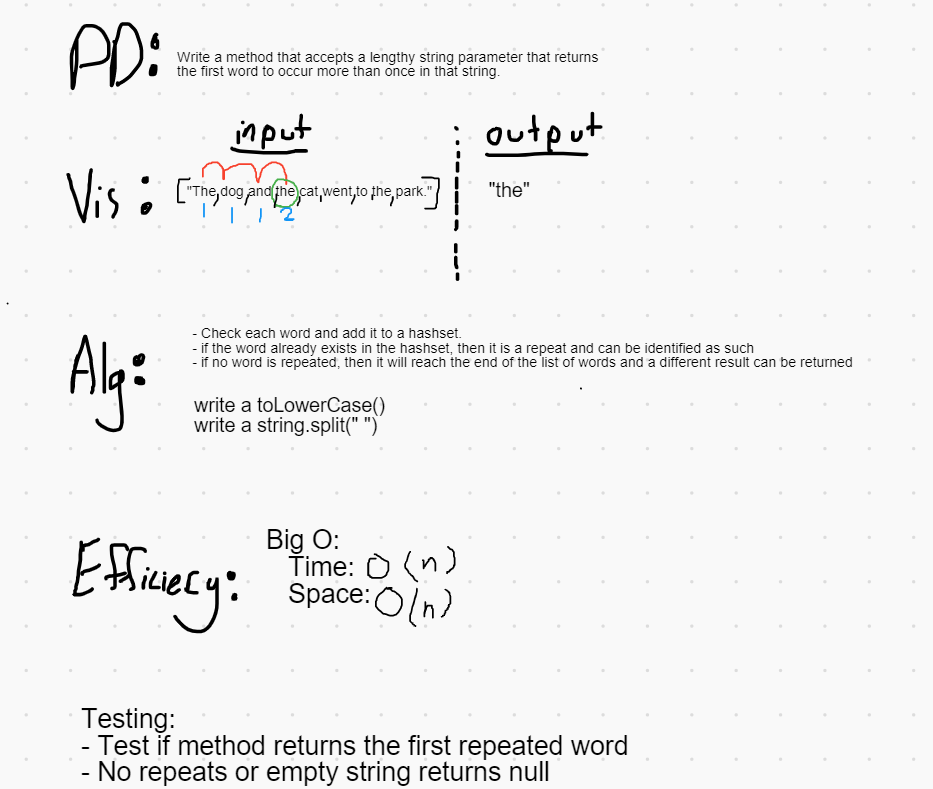

## Common Value Trees

- Find common values in 2 binary trees.

### Challenge Description 32

- The function method treeIntersection takes in two binary trees and returns a hashset of integers that are common between the two trees.

### Approach & Efficiency 32

- Big O:
  - Time: O(n^2)
  - Space: O(n)

### Solution 32

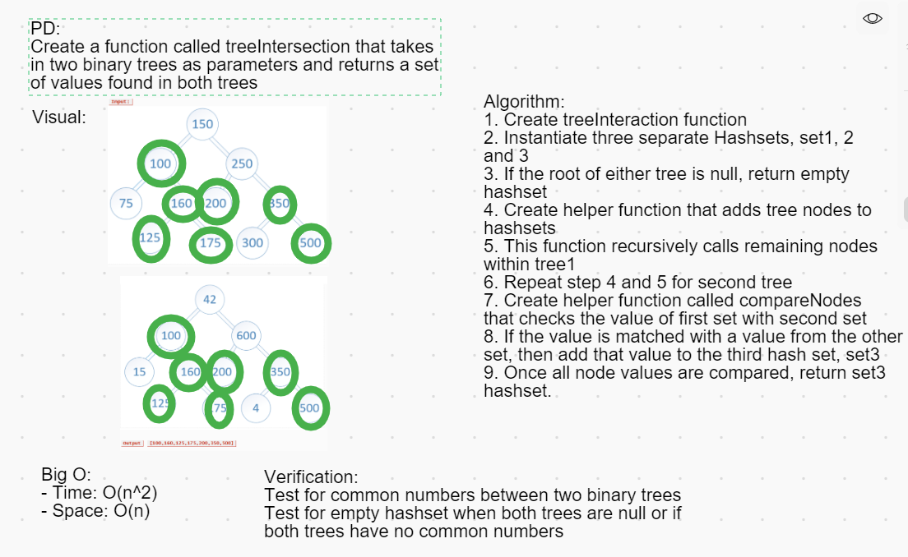

## Hashmap LEFT JOIN

- Implement a simplified LEFT JOIN for 2 Hashmaps.

### Challenge 33

- The leftJoin function LEFT Joins two hashmaps into a single data structure. If the keys in both hash maps match, assign third array position to the second hash map value.

### Approach & Efficiency 33

- Big O:
  - Time: O(n)
  - Space: O(n)

### Solution 33

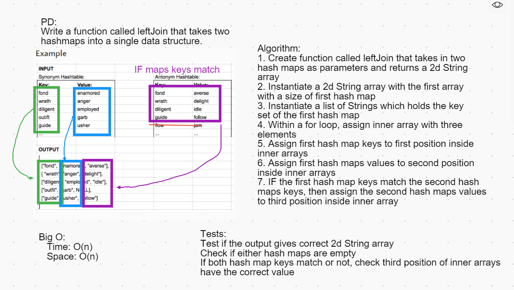

## Graph Implementation

- A graph is a data structure consisting of set of verticies and edges.

### Challenge 35

- Implement your own Graph. The graph should be represented as an adjacency list, and should include the following methods:
  - AddNode()
  - AddEdge()
  - GetNodes()
  - GetNeighbors()
  - Size()

### Approach & Efficiency 35

- Big O:
  - Time: O(1)
  - Space: O(n^2)

### API 35

- AddNode()
  - Adds a new node to the graph
  - Takes in the value of that node
  - Returns the added node
- AddEdge()
  - Adds a new edge between two nodes in the graph
  - Include the ability to have a “weight”
  - Takes in the two nodes to be connected by the edge
  - Both nodes should already be in the Graph
- GetNodes()
  - Returns all of the nodes in the graph as a collection (set, list, or similar)
- GetNeighbors()
  - Returns a collection of edges connected to the given node
  - Takes in a given node
  - Include the weight of the connection in the returned collection
- Size()
  - Returns the total number of nodes in the graph

## Breadth First Graph Traversal

- The method first visits adjacent unvisited vertices of the given node. The method marks them as visited, displayed and inserted into a queue.

### Challenge Description 36

- Implement a breadth-first traversal on a graph.
- The breadthFirstGraphTraversal method takes in any starting graph node and returns the collection of nods in the order they were visited.

### Approach & Efficiency 36

- Big O:
  - Time: O(n)
  - Space: O(3n)

### Solution 36

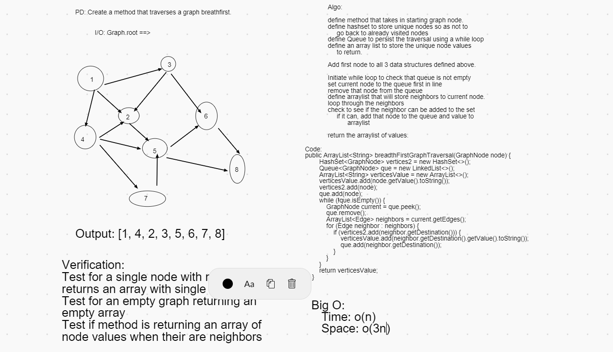

## Get Edges

- Given a business trip itinerary, and an Alaska Airlines route map, is the trip possible with direct flights? If so, how much will the total trip cost be?

### Challenge Description 37

- The function isItWorth takes in a graph and an array of city names and returns whether the full trip is possible with direct flights, and how much it would cost.

### Approach & Efficiency 37

- Big O:
  - Time: O(n^2)
  - Space: O(n)

### Solution 37

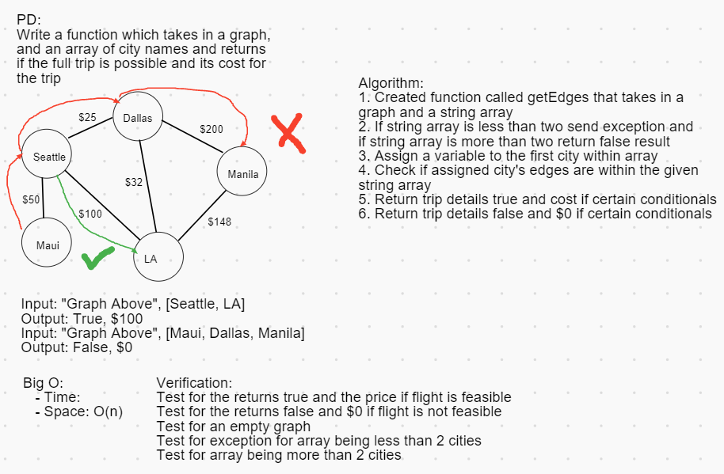

## Depth Graph Traversal

Conduct a depth first preorder traversal on a graph

### Challenge Description 38

- The function depthFirstGraphTraversal takes in a graph and traverses forward (in depth) while there is further possible nodes. If not the, the function backtracks and continues until who graph is traversed. The function will return a collection of nodes in their pre-order depth-first traversal order.

### Approach & Efficiency 38

- Big O:
  - Time: O(V + E)
  - Space: O(n)

### Solution 38

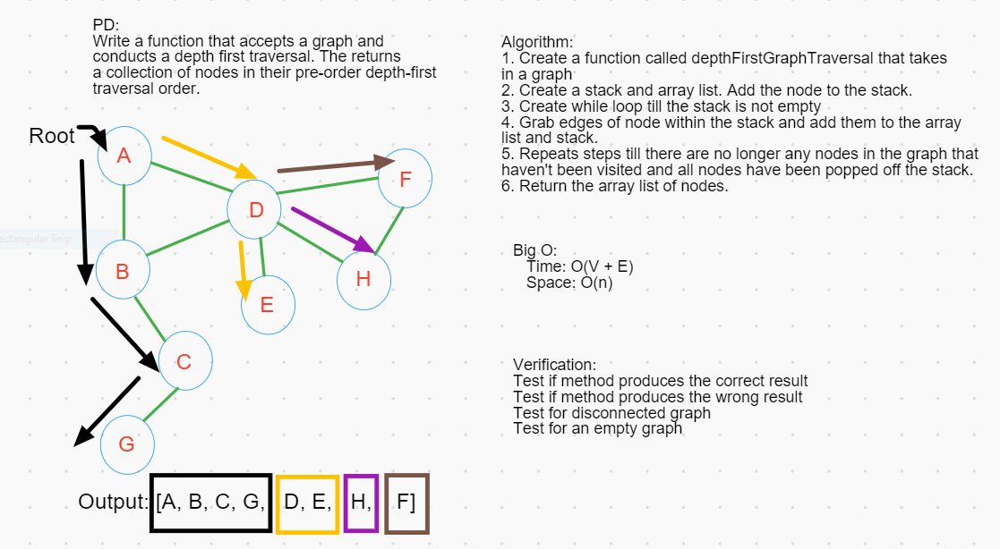

__________________________________________________________________________________

## Resources

- [Method to reverse arrays](https://www.geeksforgeeks.org/reverse-an-array-in-java/)
- Assistance from Bade on CC1 with structuring my function

- [Method to round our index integer up](https://www.tutorialspoint.com/java/lang/math_ceil.htm)

- [Binary Search Method](https://www.javatpoint.com/binary-search-in-java)

__________________________________________________________________________________

## Code Challenges

## Code Challeneges Resources

- I got some advice and assistance from Tif Taylor on Code Challenge 5 Problem #4.
