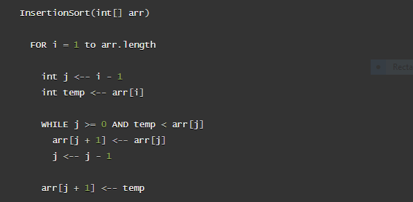
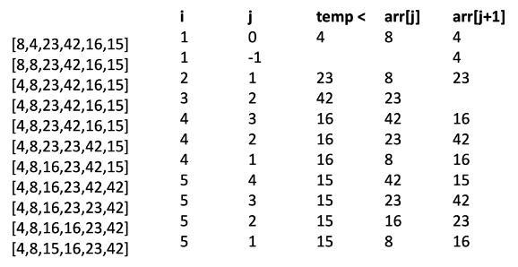

# Insertion Sort

Insertion Sort is a sorting algorithm that traverses the array multiple times as it slowly builds
out the correct sorting sequence. The array is split into two parts, sorted and unsorted. Values
 from the unsorted part are picked and placed at the correct position in the sorted part.

### Pseudocode

### Trace

Sample Array: ``[8, 4, 23, 42, 16, 15]``

#### Process

1. Traverse through the array with a for loop starting at index 1
2. If the current index's value is less than the previous index's value, then switch the positions of the two values and continue when current index's value is larger than the previous index's value down the line.
3. Once the above condition is met, set the current index's value in the correct position and move to the next index of array.
4. Repeat steps two and three till the traversal through the array is complete.

### Efficiency

- Time: O(n^2)
    - The basic operation of this algorithm is comparison. This will happen n * (n-1) number of times…concluding the algorithm to be n squared.
- Space: O(1)
    - No additional space is being created. This array is being sorted in place...keeping the space at constant O(1).
