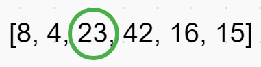

# Merge Sort

The Merge Sort method divides the input array into two halves. Then sorts the two arrays to be later merged and sorted to the correct positions within the array.

## Pseudocode

### Trace

Sample Array: ``[8, 4, 23, 42, 16, 15]``

#### Process

1. Find the middle point to divide the array into two separate arrays.

    - 

2. Call mergeSort again starting on the left array until each element of array is within individual arrays unless the left array is greater than the right.
3. Repeat step 2 on the right array from the initial mergeSort.

    - 

    - 

4. Within mergeSort is a helper method called merge which handles the arranged sorting of the array from smallest to largest, left to right.
5. Finally, once the two arrays from the first initial mergeSort is sorted, the left and right array are merge one last time to get out output result

    - 

### Efficiency

- Time: O(n log(n))
- Space: O(n)
