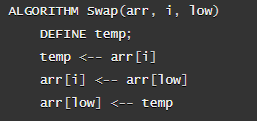
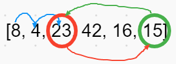
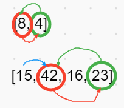

# Quick Sort

The quick sort algorithm created two empty arrays which holds elements less than the pivot value and elements greater than the pivot value. Once the values are separated in their individual arrays, the two are then sorted in their correct position within the array. The process repeats itself till the original array is sorted correctly. 

## Pseudocode

### Trace

Sample Array: ``[8, 4, 23, 42, 16, 15]``

#### Process

1. Find the pivot item in the array.
- 
2. While the value at the low pointer in the array is less than the pivot value, increment the low value by 1. Continue until the value of low is greater than or equal to the pivot value.
3. If the low value is greater or equal to the pivot value, than swap the two values.
- 
- 
4. Perform the recursive part of the algorithm where we use the partition and swap method on the left and right arrays.
- 
- 
5. Repeat steps till all elements are in their correct positions within the array.
- 
6. Repeat steps till all elements are in their correct positions within the original array.
- Swapped Original Array: ``[4, 8, 15, 16, 23, 42]``

### Efficiency

- Time: O(n log(n))
- Space: O(log(n))